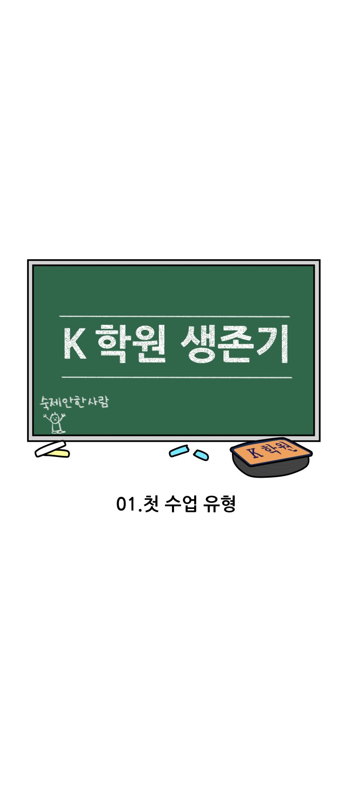
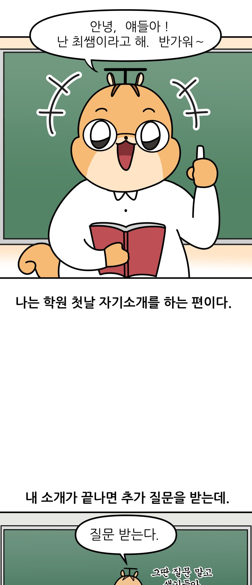
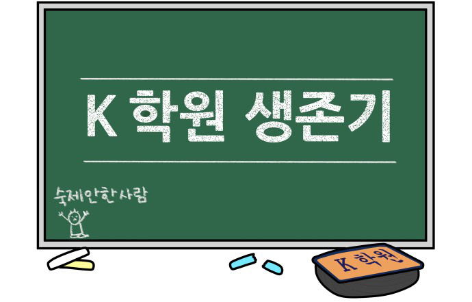
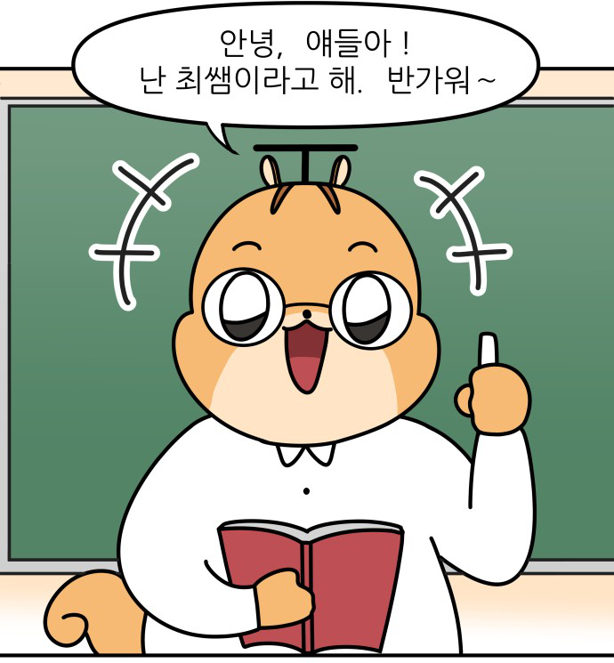

# webtoon_dataset
네이버 웹툰 크롤링 &amp; 이미지 편집 &amp; 레이블링
* 네이버 웹툰은 이미지 크롤링이 가능
* 

# Crawling
* 각각의 컷이 일정한 길이로 분할된다.
* 따라서 글자가 잘리는 부분이 생긴다.

#### 처리전

# Preprocessing
* 이미지 가로 길이 맞추기 (예외적으로 크기가 다른 경우가 있음)

# Stitching
cv 라이브러리로 vertical stitching 수행

# Spliting
흰색 선을 기준으로 split 수행

#### 처리후

